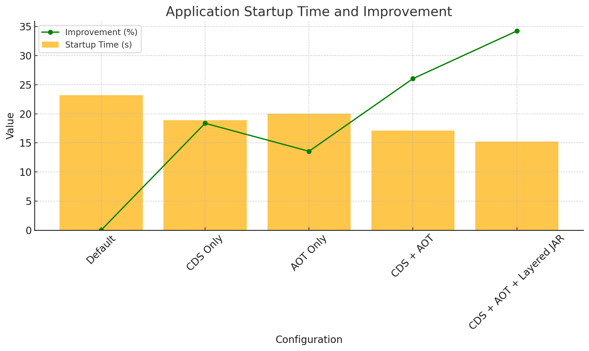
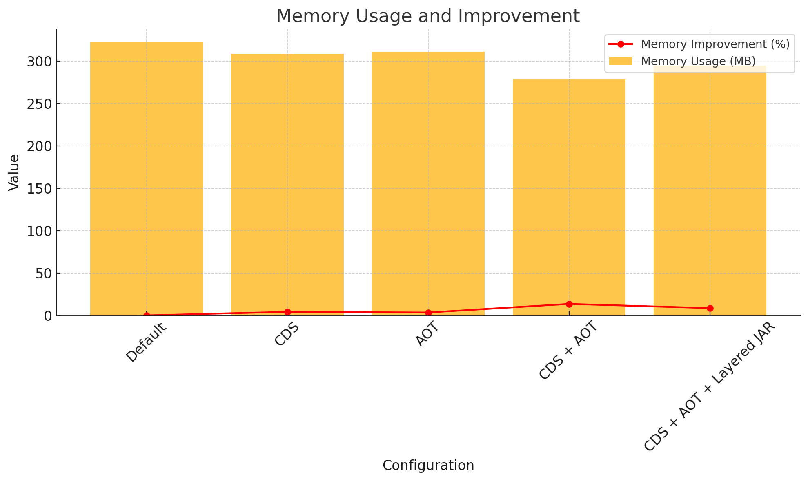

# Spring Boot Docker 최적화 예제 모음

이 레포지토리는 Spring Boot 애플리케이션을 Docker 이미지로 빌드할 때 적용할 수 있는 다양한 최적화 기법을 예제와 함께 제공합니다. 각 디렉토리는 서로 다른 최적화 기법을 적용한 `Dockerfile`을 포함하고 있습니다.

자세한 설명은 아래 블로그 게시물을 참고하시기 바랍니다.

[CDS와 AOT, Layered JAR로 Spring Boot 시작 시간, 메모리 최적화하기](https://limehee.tistory.com/3)

## 디렉토리 구조

- [base](./base): 최적화가 적용되지 않은 기본 버전
- [aot](./aot): **AOT**(Ahead-of-Time 컴파일)만 적용된 버전
- [cds](./cds): **CDS**(Class Data Sharing)만 적용된 버전
- [aot_cds](./aot_cds): **AOT**와 **CDS**가 모두 적용된 버전
- [aot_cds_layered](./aot_cds_layered): **AOT**, **CDS**, **Layered JAR**가 모두 적용된 버전

## 성능 비교

각 버전별로 애플리케이션의 시작 시간과 메모리 사용량을 비교한 결과는 다음과 같습니다.

### 애플리케이션 시작 시간

| 조건                      | 시작 시간 (초) | 개선율 (%)    |
|-------------------------|-----------|------------|
| 기본 설정                   | 23.176    | 0.00%      |
| CDS                     | 18.918    | 18.37%     |
| AOT                     | 20.033    | 13.56%     |
| CDS + AOT               | 17.14     | 26.04%     |
| CDS + AOT + Layered JAR | 15.241    | **34.24%** |

### 메모리 사용량

| 조건                      | 메모리 사용량 (MB) | 개선율 (%)    |
|-------------------------|--------------|------------|
| 기본 설정                   | 321.8        | 0.00%      |
| CDS                     | 308.3        | 4.19%      |
| AOT                     | 310.9        | 3.39%      |
| CDS + AOT               | 278.2        | **13.54%** |
| CDS + AOT + Layered JAR | 294.3        | 8.55%      |

## 라이선스

이 프로젝트는 MIT 라이선스로 배포됩니다. 자세한 내용은 [LICENSE](./LICENSE)를 참조하세요.
